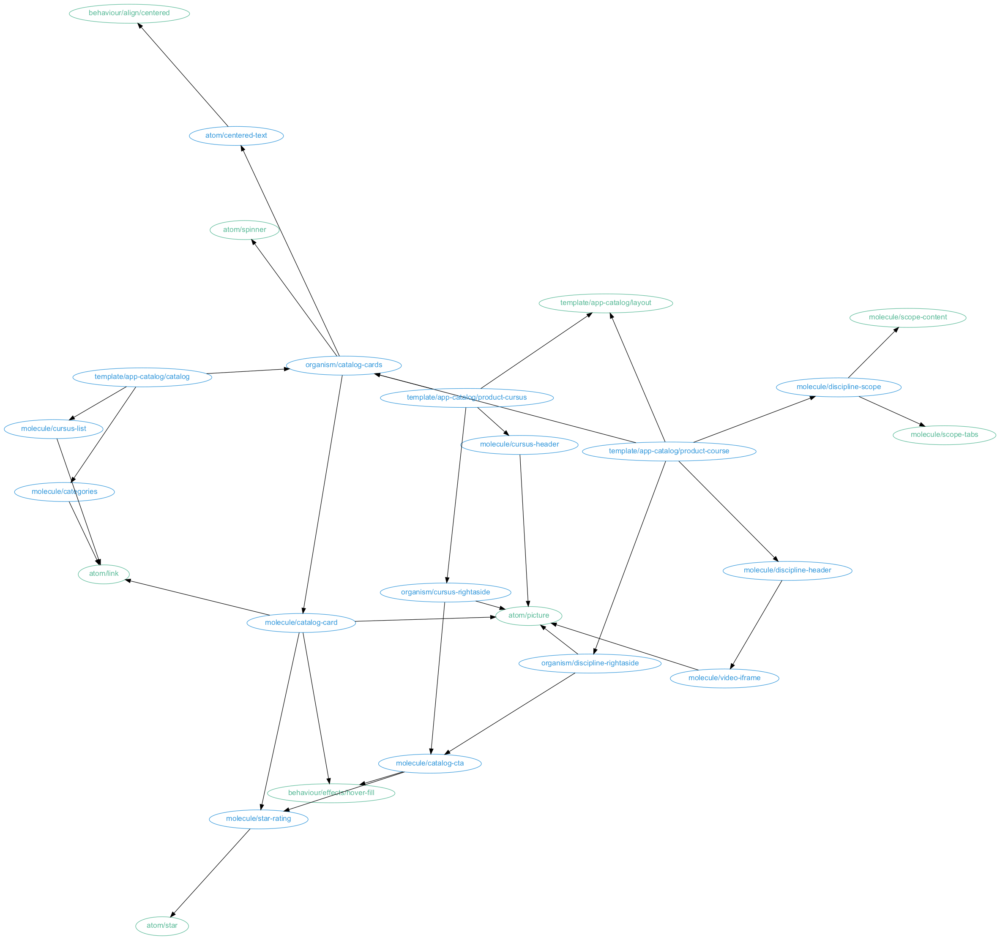

[](https://travis-ci.org/CoorpAcademy/components)
[](https://coveralls.io/github/CoorpAcademy/components?branch=master)
[](https://gitpitch.com/coorpacademy/tekacademy/components?grs=github&t=night)

# Coorpacademy components

[](https://greenkeeper.io/)

This library provide sharable components for web applications, either :
- as CommonJS components
- as a minified library

# Storybook

[here](http://coorpacademy.github.io/components/)

### Goal

- edit a component once, share it across all our platforms
- provide a documentation referencing every component with its
  - available states (disabled, selected)
  - skinable properties
- provide the smallest lib

### Styleguide / component list



# Development

### Live sandbox

```
npm install
npm run start:components
```

Then open `http://localhost:3004`

### Locally use `/lib` in an external project
- use `npm link` to create a local `@coorpacademy/components` package
- use `npm link @coorpacademy/components` in your project.

### Unit Tests with eslint and ava
```
npm test
```

### Publish
```
npm run publish:latest
```

### Developing apps using HMR and components
```
[@coorpacademy-components]> npm run build:es -- --watch
[@coorpacademy-app-player]> npm start
```

### Troubleshooting
#### lerna
Lerna is used to plug and publish all the packages in this repo.
You may have to reset all `node_modules` : use `lerna clean` before performing `npm i` again.
